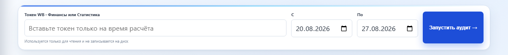
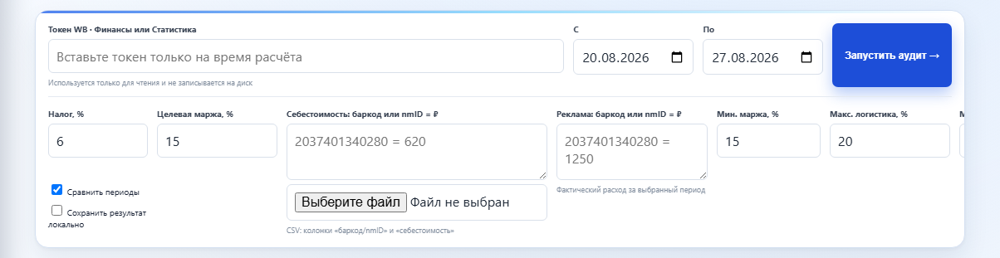
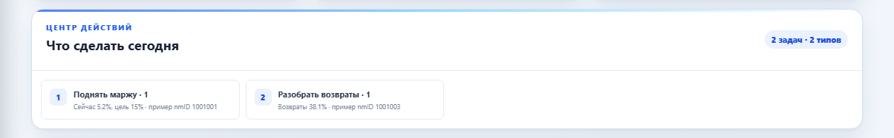
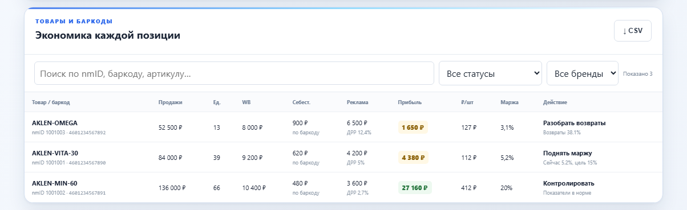
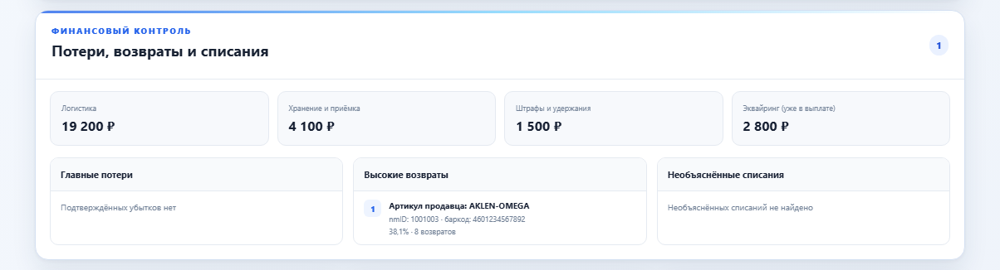
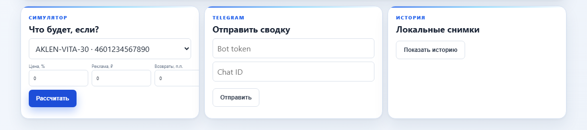
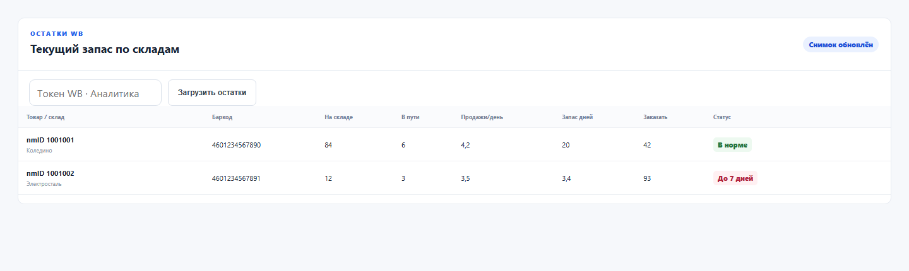
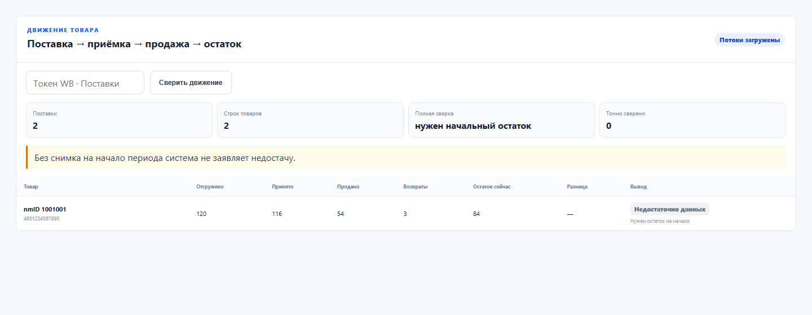
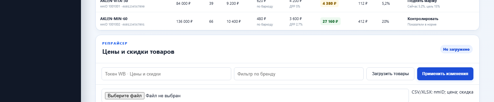

# WB Profit Firewall
## WB Profit Firewall / Защита прибыли WB

### Чем проект отличается от облачной аналитики и кабинета WB

WB Profit Firewall не заменяет кабинет продавца WB и не является облачным сервисом аналитики или демонстрационным Power BI-отчётом. По сравнению с ними это локальный инструмент для проверяемого финансового аудита собственного кабинета WB:

- **Данные остаются у продавца.** Приложение запускается на `127.0.0.1`, не требует регистрации, внешней базы данных или передачи финансового отчёта стороннему сервису.
- **Официальная финансовая детализация WB.** Продажи, возвраты, выплаты, логистика, хранение, приёмка, штрафы и удержания берутся напрямую из WB API категории «Финансы».
- **Честная прибыль вместо красивой цифры.** Если для товара не найдена себестоимость, приложение не подменяет её нулём и не выдаёт неподтверждённую прибыль.
- **Паспорт точности.** Интерфейс показывает долю товаров и оборота, покрытую себестоимостью, наличие рекламных данных и ограничения результата.
- **Проверяемая расшифровка.** Для каждой позиции видны артикул продавца, `nmID`, баркод, компоненты расходов и причина предупреждения.
- **Финансовая диагностика.** Отдельно выделяются главные потери, возвраты, штрафы, необъяснённые списания и технические операции WB.
- **Минимальные разрешения.** Финансы, остатки и фотографии запрашиваются отдельными read-only токенами только тогда, когда соответствующая функция действительно нужна.
- **Простой локальный запуск.** Для работы не нужны Docker, PostgreSQL, платная подписка или внешний BI-инструмент — достаточно Node.js и браузера.

Проект распространяется по лицензии MIT и предназначен для прозрачной управленческой проверки. Изменение цены выполняется только внутри карточки конкретного товара, с предпросмотром, явным подтверждением, проверкой задания WB и повторным чтением фактической цены.

**Визуальный обзор интерфейса**

### 1. Запуск финансового аудита

Укажите read-only токен WB категории «Финансы», выберите период и запустите проверку. Токен используется только во время запроса и не сохраняется на диск.



### 2. Себестоимость и настройки расчёта

Нажмите «Настроить расчёт», укажите налог и целевую маржу, затем внесите себестоимость вручную в формате `баркод или nmID = сумма` либо загрузите файл CSV, XLS или XLSX. Себестоимость всегда указывается **за одну единицу товара**, без символа рубля.



Рекомендуемый формат таблицы:

| Баркод | Себестоимость |
| --- | ---: |
| 4610151100625 | 120.50 |
| 4627074811491 | 76.65 |

Вместо колонки `Баркод` можно использовать `nmID`:

| nmID | Себестоимость |
| --- | ---: |
| 60945887 | 120.50 |
| 862949614 | 76.65 |

Правила импорта:

- поддерживаются `.csv`, `.xls` и `.xlsx`; для Excel читается первый лист;
- строка заголовков может находиться не на первой строке;
- рекомендуемые заголовки идентификатора: `Баркод`, `Штрихкод`, `Штрих код` или `nmID`;
- рекомендуемый заголовок стоимости: `Себестоимость`; также распознаются `cost`, `закупочная цена` и `цена закупки`;
- десятичная часть может быть записана через точку или запятую;
- пустые строки и значения без числовой себестоимости пропускаются;
- при повторе одного ключа используется последнее значение;
- если в прайсе присутствуют и баркод, и `nmID`, точный баркод имеет приоритет;
- для сохранения ведущих нулей колонку с идентификаторами в Excel лучше хранить в текстовом формате.

После импорта приложение показывает количество распознанных строк. Покрытие себестоимостью проверяйте в «Паспорте точности»: прибыль по товарам без найденной себестоимости не подтверждается.

### 3. Ключевые показатели и прогноз денег

Карточки показывают изменение результата, обнаруженный финансовый риск, прогноз выплат на 7 и 30 дней, рекомендуемый резерв и доступную после резерва сумму.


### 4. Приоритетные действия

Центр действий группирует проблемы по важности: убыточность, низкая маржа, возвраты, реклама, логистика и отсутствующая себестоимость. Каждая задача содержит количество затронутых позиций и пример `nmID`.



### 5. Экономика каждого товара

Таблица раскрывает продажи, расходы WB, себестоимость, рекламу, прибыль на единицу и маржу. Товар можно найти по названию, артикулу продавца, `nmID` или баркоду и отфильтровать по статусу и бренду.



### 6. Потери, возвраты и списания

Блок отдельно показывает логистику, хранение и приёмку, штрафы и удержания, эквайринг, главные подтверждённые потери, товары с повышенными возвратами и необъяснённые операции WB.



### 7. Планирование и уведомления

Симулятор оценивает изменение прибыли при новой цене, рекламе или возвратности. Рядом находятся отправка текущей сводки в Telegram и локальная история сохранённых расчётов.



> Alpha: расчёт является управленческой оценкой, не бухгалтерским или налоговым
> заключением. Автоматическое изменение цен и рекламы пока отключено.

## Запуск

Нужен Node.js 20+. После клонирования установите зависимости и запустите локальный сервер:

```powershell
npm.cmd install
npm.cmd test
npm.cmd start
```

Откройте `http://127.0.0.1:3847`. Введите отдельный read-only токен WB категории
`Финансы`, период и себестоимость товаров. Себестоимость можно указывать по
баркоду или `nmID`; значение баркода имеет приоритет для вариантов одной карточки.
Токен передаётся локальному серверу
в памяти, используется для прямого запроса WB и не сохраняется.

## Что считается

- продажи и возвраты;
- сумма к перечислению;
- логистика, хранение, приёмка, эквайринг, штрафы и удержания;
- себестоимость и ориентировочный налог;
- расчётная прибыль, маржа и минимальная безопасная цена;
- отдельные строки и себестоимость для каждого баркода внутри артикула WB.

## Дополнительные возможности

- паспорт точности: покрытие себестоимостью по товарам и обороту, источник рекламы и предупреждения;
- экономика каждой позиции: прибыль на единицу, возвратность, ДРР и доля логистики;
- центр приоритетных действий «что сделать сегодня»;
- поиск по названию, nmID, баркоду и артикулу, фильтрация по статусу и бренду;
- экспорт отфильтрованной таблицы в CSV;
- импорт себестоимости из CSV по баркоду или `nmID`;
- импорт старых `.xls` и современных `.xlsx` с первого листа прямо в браузере;
- ручной учёт рекламных расходов по товару;
- финансовый контроль: отдельные суммы логистики, хранения, приёмки, штрафов, удержаний и эквайринга;
- рейтинги главных потерь и повышенных возвратов с явными артикулами продавца, `nmID` и баркодами;
- поиск необъяснённых списаний и показ нераспределённых технических операций WB;
- загрузка текущих остатков по складам, расчёт продаж в день, запаса в днях и рекомендуемого заказа на 30 дней;
- загрузка названия и фотографий выбранной карточки WB по запросу;
- сравнение с предыдущим периодом и основные причины изменения прибыли;
- финансовый светофор и настраиваемые пороги маржи, логистики и ДРР;
- симулятор изменения цены, рекламы и возвратов;
- прогноз выплат и рекомендуемый денежный резерв;
- опциональная локальная история агрегированных расчётов;
- отправка текущей сводки через Telegram-бота;
- показатель обнаруженного риска без ложного заявления о «сохранённых деньгах».

Excel-файл читается локально библиотекой SheetJS; содержимое не отправляется
на внешний сервер. Для Excel берётся первый лист, а названия колонок
«баркод/nmID» и «себестоимость» распознаются автоматически.

Сравнение периодов сначала использует локальную историю, чтобы не превышать
лимиты WB API. История сохраняется только при включённом пользователем флажке.
Telegram bot token и chat ID используются однократно и не записываются на диск.

## Токены и разрешения WB

Функции разделены по минимально необходимым категориям доступа:

- **Финансы** — финансовая детализация, продажи, возвраты, выплаты и расходы для основного аудита;
- **Аналитика** — текущие остатки по складам и прогноз дефицита;
- **Контент** — название и фотографии выбранной карточки товара.

Один токен работает только с выданными ему категориями. Для остатков и фотографий
можно использовать отдельные read-only токены; они передаются только во время
соответствующего запроса и не сохраняются приложением.

Автоматическое изменение цен, рекламы и участия в акциях намеренно отсутствует
в alpha-версии. Оно потребует отдельных минимальных API-разрешений, журнала
действий, предварительного просмотра и явного подтверждения продавца.

Без себестоимости прибыль не показывается. Формула и отдельные компоненты будут
расширяться по мере проверки на реальных отчётах.

## Границы точности

Суммы WB берутся из официальной финансовой детализации. Себестоимость, налог и
реклама являются пользовательскими данными или управленческими настройками.
Интерфейс всегда показывает покрытие расчёта; незаполненная себестоимость не
подменяется нулём. Реклама, если не введена, считается нулевой с явным
предупреждением. Для бухгалтерских решений сверяйте результат с учётной системой.

Подробная карта источников, формул, токенов и ограничений находится в
[паспорте данных и точности](./docs/DATA_ACCURACY.md).

Текущий снимок остатков сам по себе не позволяет доказать недостачу за период:
нужен также снимок на начало этого же периода. Раздел движения показывает
«Недостаточно данных», пока начальный остаток неизвестен.

В репрайсере «будет» означает цену продавца после его скидки. Витринная цена
может отличаться из-за скидок и акций, финансируемых Wildberries.

### Как читать идентификаторы и полноту

- **Артикул продавца** — поле WB `sa_name`; короткие значения вроде `00625` допустимы и не являются `nmID`.
- **nmID** — основной числовой идентификатор карточки WB.
- **Баркод** — идентификатор конкретного варианта. В рейтингах показываются все три значения, чтобы товар можно было однозначно проверить в кабинете.
- Технические строки отчёта с нулевым или отсутствующим `nmID` не считаются товарами. Их расходы остаются в общей сверке как нераспределённые операции.
- Статус «частичный расчёт» означает, что прибыль подтверждена только для покрытой себестоимостью части оборота. До 100% покрытия общий результат нельзя трактовать как полную прибыль кабинета.
- Эквайринг показывается для контроля, но не вычитается повторно из поля «к перечислению продавцу».

### Важные правила расчёта

- При ответе WB `429` запрос завершается понятным сообщением: повторите позже; данные не подменяются демо-значениями.
- Комиссия и удержания берутся из финансового отчёта WB. «Безопасная цена» — управленческая оценка с учётом фактической нагрузки отчёта, возвратов, себестоимости, рекламы, налога и целевой маржи.
- Поле «к перечислению продавцу» не уменьшается повторно на эквайринг: комиссия за приём платежа показывается отдельно для контроля и уже отражена в финансовой детализации выплаты. Технические строки WB без положительного `nmID` не считаются товарами, а их услуги показываются как нераспределённые операции.
- Ставка налога задаётся пользователем и не является налоговой консультацией — учитывайте свою систему налогообложения.
- При конфликте одинаковых ключей в импорте используется последнее значение. Для мультивариантных карточек точный баркод имеет приоритет над `nmID`.

## Roadmap

Ближайший приоритет — доказуемая сверка движения товара и финансовых операций.
После неё планируются история и прогнозирование, безопасные рекомендации,
полуавтоматические действия, мультиаккаунтность, другие маркетплейсы и только
затем добровольный категорийный бенчмаркинг.

[Открыть подробный roadmap с этапами и критериями готовности](./ROADMAP.md)

Проект не аффилирован с Wildberries.


### 8. Новые операционные блоки

Эти блоки добавлены после основного walkthrough из семи шагов:

**Остатки по складам** — отдельный Analytics-токен, текущие количества, продажи в день и запас в днях.



**Сверка движения товара** — поставка, приёмка, продажи и расчёт расхождений по 
mID/баркоду.



**Репрайсер** — токен «Цены и скидки», фильтр бренда, загрузка таблицы CSV/XLSX и предпросмотр массовых изменений.




