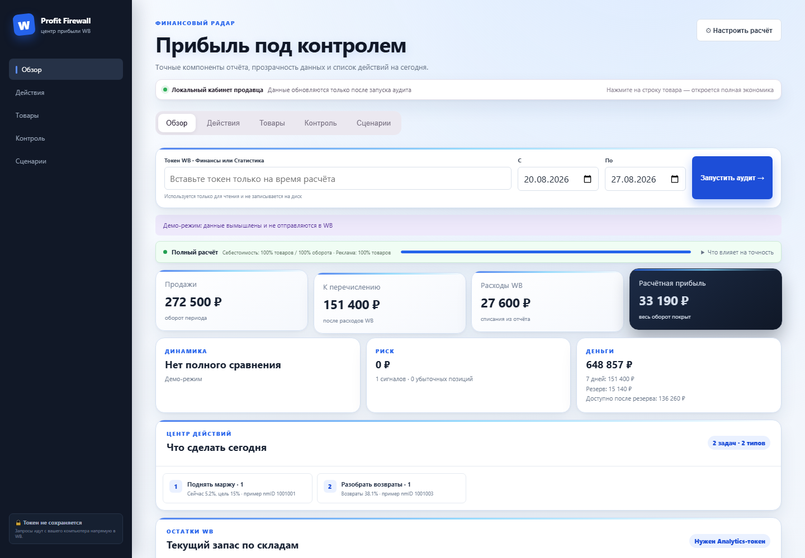
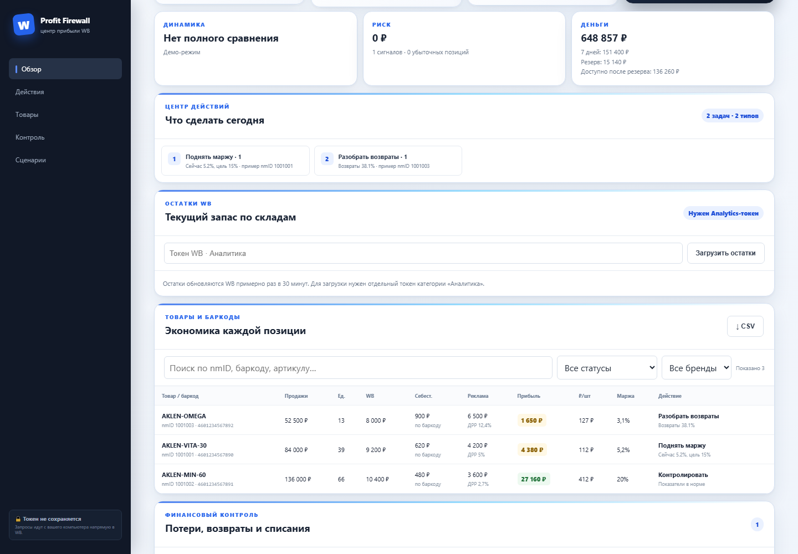
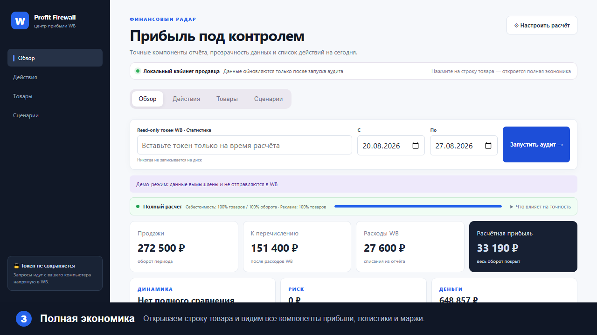

# WB Profit Firewall

Локальная open-source панель финансового контроля продавца Wildberries. Она
сверяет выплаты и расходы WB с продажами, возвратами, себестоимостью и остатками,
чтобы показать реальную прибыль по каждому товару и подсветить места, где теряются
деньги.

**Визуальный обзор интерфейса**








[Открыть интерактивный гайд со стрелками и пояснениями](./public/user-guide.html)

> Alpha: расчёт является управленческой оценкой, не бухгалтерским или налоговым
> заключением. Автоматическое изменение цен и рекламы пока отключено.

## Запуск

Нужен Node.js 20+. Зависимостей нет.

```powershell
npm.cmd test
npm.cmd start
```

Откройте `http://127.0.0.1:3847`. Введите отдельный read-only токен WB категории
`Статистика`, период и себестоимость товаров. Себестоимость можно указывать по
баркоду или `nmID`; значение баркода имеет приоритет для вариантов одной карточки.
Токен передаётся локальному серверу
в памяти, используется для прямого запроса WB и не сохраняется.

## Что считается

- продажи и возвраты;
- сумма к перечислению;
- логистика, хранение, приёмка, эквайринг, штрафы и удержания;
- себестоимость и ориентировочный налог;
- расчётная прибыль, маржа и минимальная безопасная цена;
- отдельные строки и себестоимость для каждого баркода внутри артикула WB.

## Дополнительные возможности

- паспорт точности: покрытие себестоимостью по товарам и обороту, источник рекламы и предупреждения;
- экономика каждой позиции: прибыль на единицу, возвратность, ДРР и доля логистики;
- центр приоритетных действий «что сделать сегодня»;
- поиск и фильтрация по статусу, nmID, баркоду и артикулу;
- экспорт отфильтрованной таблицы в CSV;
- импорт себестоимости из CSV по баркоду или `nmID`;
- импорт старых `.xls` и современных `.xlsx` с первого листа прямо в браузере;
- ручной учёт рекламных расходов по товару;
- сравнение с предыдущим периодом и основные причины изменения прибыли;
- финансовый светофор и настраиваемые пороги маржи, логистики и ДРР;
- симулятор изменения цены, рекламы и возвратов;
- прогноз выплат и рекомендуемый денежный резерв;
- опциональная локальная история агрегированных расчётов;
- отправка текущей сводки через Telegram-бота;
- показатель обнаруженного риска без ложного заявления о «сохранённых деньгах».

Excel-файл читается локально библиотекой SheetJS; содержимое не отправляется
на внешний сервер. Для Excel берётся первый лист, а названия колонок
«баркод/nmID» и «себестоимость» распознаются автоматически.

Сравнение периодов сначала использует локальную историю, чтобы не превышать
лимиты WB API. История сохраняется только при включённом пользователем флажке.
Telegram bot token и chat ID используются однократно и не записываются на диск.

Автоматическое изменение цен, рекламы и участия в акциях намеренно отсутствует
в alpha-версии. Оно потребует отдельных минимальных API-разрешений, журнала
действий, предварительного просмотра и явного подтверждения продавца.

Без себестоимости прибыль не показывается. Формула и отдельные компоненты будут
расширяться по мере проверки на реальных отчётах.

## Границы точности

Суммы WB берутся из официальной финансовой детализации. Себестоимость, налог и
реклама являются пользовательскими данными или управленческими настройками.
Интерфейс всегда показывает покрытие расчёта; незаполненная себестоимость не
подменяется нулём. Реклама, если не введена, считается нулевой с явным
предупреждением. Для бухгалтерских решений сверяйте результат с учётной системой.

### Важные правила расчёта

- При ответе WB `429` запрос завершается понятным сообщением: повторите позже; данные не подменяются демо-значениями.
- Комиссия и удержания берутся из финансового отчёта WB. «Безопасная цена» — управленческая оценка с учётом фактической нагрузки отчёта, возвратов, себестоимости, рекламы, налога и целевой маржи.
- Ставка налога задаётся пользователем и не является налоговой консультацией — учитывайте свою систему налогообложения.
- При конфликте одинаковых ключей в импорте используется последнее значение. Для мультивариантных карточек точный баркод имеет приоритет над `nmID`.

## Roadmap

- полноценный импорт XLSX;
- read-only загрузка рекламы через отдельную категорию WB API;
- история тарифов, цен и акций;
- расписание Telegram-уведомлений;
- безопасные действия только после явного подтверждения продавца.

Проект не аффилирован с Wildberries.
